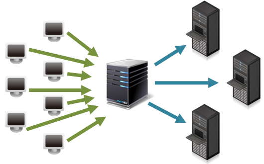
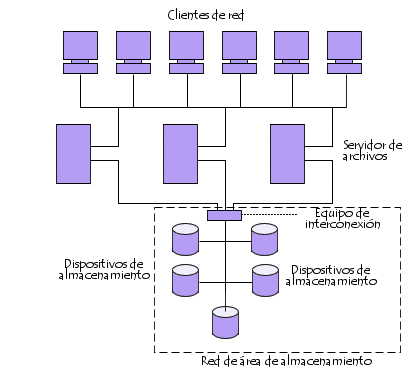
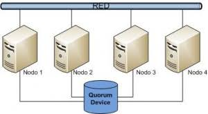
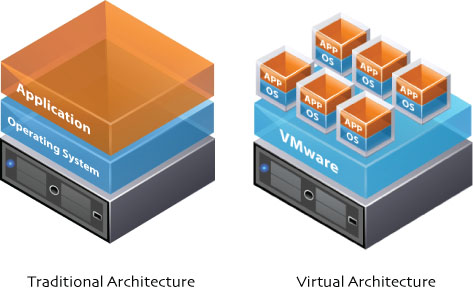

# Alta disponibilitat
**INS Carles Vallbona**
**Pau Tomé**
**2017/2018**

# Alta disponibilitat
**Definició:**

Capacitat de que aplicacions i dades es trobin operatius per als usuaris autoritzats en tot moment, degut al seu caràcter crític.

~~~
Les empreses amb alta disponibilitat són més tolerants a fallades del
sistema, minimitzant el risc d'inactivitat.
~~~

**Redundància en dispositius hardware: ** possibilita, en cas de fallada, continuïtat del servei.

- Exemples:

~~~
- Servidors duplicats (balanceig, clúster).
- Fonts d’alimentació duplicades que eviten talls de subministrament.
- Link aggregation o bonding o port trunking: Dispositius de xarxa redundants que eviten caigudes  de connectivitat (https://en.wikipedia.org/wiki/Link_aggregation).
~~~

# Solucions d’alta disponibilitat

- **Redundància, distribució i fiabilitat en la gestió de la informació:** S’ha de procurar que la informació pugui ser recuperada en el moment que es necessiti, evitar la pèrdua  o bloqueig tant per atac, mala operació accidental o situacions fortuïtes.

- Exemple de tècniques a usar:

~~~
   - Sistemas RAID d’emmagatzematge
   Les més habituals RAID1 i RAID5 (vistes a la UF1).

   - Centres de processament de dades (CPD) de recolzament
   Garanteixen còpies de seguretat en diverses ubicacions geogràfiques.
~~~

# Solucions d’alta disponibilitat

- **Redundància en les comunicacions:** Contractació de diferents connexions a la xarxa (Internet) independents, per poder disposar d'alternatives en cas de caiguda d'alguna connexió.

- **SAN, Fibre channel i iSCSI:** Una SAN (Storage Area Network) és una xarxa concebuda per a connectar servidors, matrius (arrays) de discos i libreries de suport. Principalment, basada en tecnología fibre channel i més recentement en iSCSI.

- **Balanceig de càrrega i Clustering:** Redundància de servidors i distribució de tasques i comunicacions.

- **Independència en l’administració i configuració d'   aplicacions i serveis:** Mitjançant la virtualització.

# Balanceig de càrrega

- **Balancejador de càrrega:** dispositiu hardware o software connectat a un conjunt de servidors que assigna i reparteix les peticions que provenen dels clients als diversos servidores als que es connecta.

Per a repartir la càrrega de forma equilibrada utilitzen algorismes com Round Robin, per exemple.    

# SAN

- **Funció:** Connectar de manera ràpida, segura i fiable els elements que la conformen. De vital importància és que es trobi en una ubicació separada geogràficament distant a la ubicació dels servidors.

# SAN
- Una **xarxa SAN** es distingeix d'altres modes d'emmagatzemament en xarxa pel mode d'accès a baix nivell: el tipus de tràfic en una SAN és molt semblant al dels discos durs com ATA, SATA i SCSI. (https://es.wikipedia.org/wiki/Red_de_%C3%A1rea_de_almacenamiento)

- **Varis servidors poden tenir accés al mateix volum de dades** per un o varis camins depenent de la topologia i configuració de la SAN. És l'escenari adequat pels entorns crítics i per la implementació de clusters de servidors.

- La major part de SAN actuals usen el protocol **SCSI** per accedir a les dades de la SAN, tot i que no usin interfícies físiques SCSI.

- La SAN és una xarxa d'emmagatzemament dedicada que proporciona accés de nivell de bloc a **LUNs**.

- **LUN (número d'unitat lògica):** disc virtual proporcionat
por la SAN. L'administrador del sistema te el mateix accés i drets a la LUN com si fos un disc directament conectat al sistema. L'administrador pot particionar i formatar el disc en qualsevol mitjà que esculli.

- Els dos protocols de xarxa més usats en una SAN són **Fibre Channel i iSCSI**.

# Fibre Channel i iSCSI

- **FibreChannel:** molt ràpida i no li afecta el tràfic de la xarxa LAN de l'empresa. Però és molt cara: Les targetes a partir de 300 euros les més senzilles. També requereixen switchs especials de canal de fibra.
(https://en.wikipedia.org/wiki/Fibre_Channel)

- **iSCSI:** Tecnología que envía comandes SCSI sobre una xarxa TCP/IP. No és tan ràpid com una xarxa Fibre Channel, perè estalvia costos, ja que usa un maquinari de xarxa menys costós (simples targetes Ethernet). S'aprofita de la tecnologia Gigabit Ethernet.
(https://es.wikipedia.org/wiki/ISCSI)

# Balanceig de càrrega

- **Utilitat:** Poder repartir la càrrega y excloure aquelles connexions de destí que es trobin caigudes en un moment determinat.

**Exemple:** Un client no pot contactar amb el seu servidor DNS (caigut). El balancejador de càrrega detectarà que està inactiva i les peticions s’enviaran a una altre servidor DNS connectat al dispositiu encarregat del balanceig de la carga.

- **Aplicacions:** Repartir peticions de xarxa entre múltiples servidors web, DNS, etc. redundants, o entre vàries connexions de xarxa pública independents.

# Balanceig de càrrega

**Exemple:** Per unificar dues o més connexions amb salida cap a Internet en una sola. S’instal·la un balancejador de càrrega al que es connecten vàries línies d’Internet.

Exemple:

~~~

Pfsense:
- Podem repartir la càrrega de sortida a Internet entre les línies.
- Es pot definir quina quantitat de peticions sortiran per cada línia
- Depenent per exemple de la velocidad i fiabilidad o la càrrega.

~~~

# Clustering

- **Clustering o agrupament:** un conjunt d'unitats funcionals interconnectades per mitjà d'una xarxa que actuen com una sola unitat.

- Cadascun dels ordinadors que formen part d'un clúster s'anomena "node".

# Clustering: Tipus

- És una classe d'arquitectura de computador paral·lel que es basa a unir màquines independents integrades per mitjà de xarxes d'interconexió, per obtenir un sistema coordinat, capaç de processar una càrrega

Actualment existeixen dos tipus de clústers:

- D’alta disponibilitat

- D’alt rendiment.

# Clúster d’alta disponibilitat

**D'alta disponibilitat:** destinats a la necessitat de suportar un error de maquinari o programari. Si un dels nodes cau, la resta es reparteixen les seves tasques i intenten reactivar-lo. Aquest seria el cas de servidors web, ordinadors que han de prestar servei les 24h del dia els 365 dies de l'any.

Tenim dos tipus de cúster d’alta disponibilitat:

- Configuració actiu-actiu

- Configuració actiu-passiu (failover)

# Configuració actiu-actiu:
## (Clúster d’alta disponibilitat)

- Tots els nodes estan operatius executen els mateixos recursos de forma simultània.

- En cas de fallada en un dels nodes, la resta de nodes del clúster podrien oferir els mateixos serveis, però augmentaria la càrrega dels altres nodes i la qualitat del servei es podria veure afectada.

- Aquesta configuració permet aprofitar molt millor els recursos del clúster, ja que tots els nodes poden treballar de forma simultània. La implantació d’un solució d’aquest tipus és bastant més complexa que una configuració actiu-passiu.

# Configuració actiu-passiu
## (Clúster d’alta disponibilitat)

- **Configuració actiu-passiu (failover):** el node actiu està operatiu i és l’encarregat d’oferir el servei als usuaris, mentre que el node passiu està aturat i només entra en funcionament quan el node actiu pateix una fallada.

Aquest tipus de configuració és menys eficient que l’actiu-actiu, ja que en un moment determinat només s’aprofiten els recursos d’un dels dos nodes.

# Clúster d’alt rendiment
- Es basen en un conjunt de màquines configurades per aconseguir una capacitat de càlcul màxima al repartir-se la càrrega dels processos entre els nodes existents.

- Utilitzats en la resolució d'algorismes científics, reproducció d'imatges 3D, compilació de grans codis de programació, xifrat de contrasenyes…

# Independència en l'administració i configuració d'aplicacions i serveis.

- Mitjançant la virtualització es poden oferir de manera independent servidors dedicats suportats sota una mateixa màquina.

- La virtualització permet l'execució simultània de diferents sistemes operatius mitjançant un únic equip per a realitzar-lo.

# Virtualització

- Permet realitzar una abstracció dels recursos d'un sistema creant una capa entre el hardware de l'equip físic i el sistema operatiu de la màquina virtual. Aquesta capa gestiona els recursos principals de l'equip amfitrió com són la CPU, memòria, xarxa i emmagatzematge.

- Una de les aplicacions més comuns de la virtualització es poder independitzar l'administració de servidors sota una mateixa màquina física.

# Avantatges de la virtualizació

- **Estalvi de costos:** Podem adquirir un únic servidor, més potent, i no haver de comprar més servidors solament anar creant-les en el gestor de màquines virtuals. També permet estalvi en el cost de manteniment i en el de personal a més d'estalviar espai i energia.
- **Creixement més flexible:** Instal·lar un nou servidor és molt més senzill i ràpid davant de fer-ho amb un de físic.
- **Administració simplificada:** En la consola del gestor de màquines virtuals podem augmentar o reduir els recursos per a una determinada màquina, reiniciar-la, instal·lar actualitzacions o simplement esborrar-la.

# Avantatges de la virtualizació

- **Aprofitament d'aplicacions antigues:** Posibilitat de conservar aplicacions que funcionen en sistemes antics en una màquina virtual i mordenitzar la infraestructura informàtica.

- **Disminució dels temps de parada:** la virtualització pot reduir el temps de parada per exemple amb clonacions mentre una dona servei l'altre fa un manteniment d'actualitzacions. La restauració d’un equip virtual és ràpida i independent del maquinari subjacent.

# Avantatges de la virtualizació

- **Centralització de tasques de manteniment:** Podem realitzar còpies de seguretat d'un única vegada de totes les màquines, programar actualitzacions i altres activitats utilitzant el gestor de màquines virtuals.

- **Millor gestió de recursos:** Es poden augmentar la memòria o emmagatzematge de la màquina física per fer-ho també de totes les màquines virtuals a la vegada. Això fa que s'aprofitin millor les inversions en hardware.

# Avantatges de la virtualizació

- **Balanceig de recursos:** Es possible assignar un grup de servidors físics per a proporcionar recursos a les màquines virtuals i assignar una aplicació que faci un balanceig dels recursos, otorgant més memòria, recursos de procesador, emmagatzematge o ampla de banda de la xarxa a la màquina virtual que ho necessiti.

# Avantatges de la virtualizació

- **Continuïtat de negoci i recuperació davant desastres:** En cas de fallada d’un sistema físic, els sistemes lògics continguts poden distribuir-se dinàmicament a d’altres sistemes.
- **Virtual appliance:** màquines virtuals preconfigurades, carregar i funcionar. Màquines paquetitzades i preconfigurades per una función determinada (servidors de correu, bases de dades, centralites VoIP, aplicacions tancades).

# Inconvenients de la virtualizació

- Necessita hardware d’altes prestacions.
- Molts sistemes depenen d’un sol equip físic (si no tenim sistemes HA).
- Limitacions en el hardware de las màquines virtuals.
- Problemes d’emulació de certs controladors.
- Rendiment inferior.

# Altres materials a estudiar

- Alta disponibilitat IOC:
https://ioc.xtec.cat/materials/FP/Materials/2251_ASIX/ASIX_2251_M11/web/html/WebContent/u4/a1/continguts.html
- High Availability: https://en.wikipedia.org/wiki/High_availability
- Computer cluster: https://en.wikipedia.org/wiki/Computer_cluster
- Entorn virtual per provar malware: https://app.any.run/
- STONITH (Shot The Other Node In The Head): https://en.wikipedia.org/wiki/STONITH
- Fencing: https://en.wikipedia.org/wiki/Fencing_(computing)
- 10 opensource Load Balancer for HA: https://geekflare.com/open-source-load-balancer/
- MySQL Load balancing with HA Proxy: https://severalnines.com/resources/tutorials/mysql-load-balancing-haproxy-tutorial
