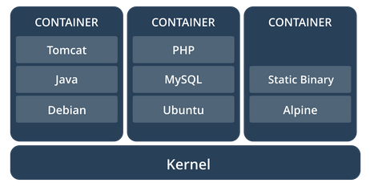
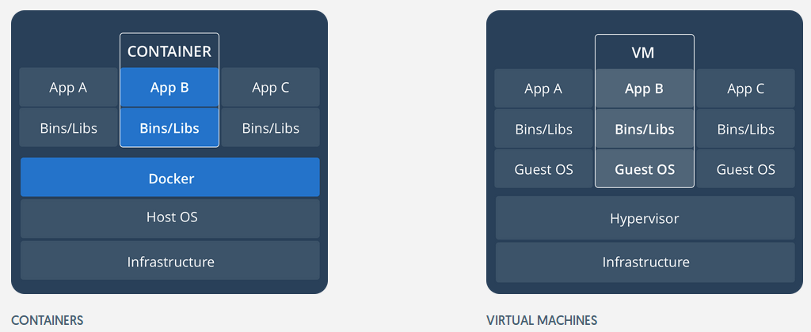

# Containers (Docker)

https://github.com/wsargent/docker-cheat-sheet

## Què és un container?

- Paquet de programari executable lleuger, independent i autosuficient.
- Inclou tot el necessari per a còrrer: codi, biblioteques, eines de sistema,configuració, etc.
- El contenidor sempre s'executa en diferents plataformes de la mateixa manera, sense canviar el comportament.
- S'aïlla el programari del seu entorn i permet que no hi hagi canvis de comportament en les etapes de desenvolupament i les de desplegament per producció

## Containers vs màquines virtuals

**Containers**

- Abstracció a la capa d'aplicació que empaqueta codi i dependències.
- Es pot executar múltiples containers a la mateixa màquina i compartir el Kernel del sistema operatiu amb altres containers.
- Cada container s'executa com un procés aïllat en l'espai d'execució de l'usuari.
- Ocupen molt menys espai que les màquines virtuals (de l'ordre de centenars de MB) i es posen en marxa pràcticament a l'instant.

**Màquines virtuals**

- Són una abstracció de màquines físiques de manera que tenim múltiples màquines en una sola.
- L'hipervisor permet que múltiples VM funcionin sobre una sola màquina real.
- Cada còpia de la VM inclou una còpia completa del sistema operatiu, una o més aplicacions i tots els binaris i llibreries. Això fa que ocupin GB.
- Les màquines virtuals també són més lentes en arrencar.

## Instal·lar Docker

- https://docs.docker.com/install/linux/docker-ce/ubuntu/

(Per altres versions, mirar https://docs.docker.com/)

## Conceptes inicials Docker

**Imatge:** Paquet executable que inclou tot el necessari per a llançar un contenidor. És el binari del contenidor. Es pot veure com el DVD d'instal·lació.

**Container (contenidor):** Instanciació de la imatge. A partir d'una imatge podem llançar o executar múltiples instàncies de contenidors. Es pot veure com un sistema instal·lat a partir del DVD d'instal·lació (i es poden llançar molts a partir d'una sola imatge).

- Un contenidor **no té persistència**, és a dir, quan es llança, es posa en marxa i quan acaba no es guarden dades ni estat.

- Si es vol guardar dades entre inicis del contenidor, cal guardar la informació en "volums".

- Podem identificar un container per ID (ex: 608eb1ee76cb), o bé per nom al·leatori que li posa el Docker en iniciar-lo (ex: loving_varahami).

## Test inicial de Docker

Per provar que docker funciona:

~~~
docker run hello-world
// Iniciar un contenidor ubuntu interactiu en terminal i executant la comanda "bash"
docker run -it ubuntu bash
~~~

## Procediment per a crear una imatge

https://docs.docker.com/engine/userguide/eng-image/dockerfile_best-practices/

https://docs.docker.com/engine/reference/builder/

- Crear directori al disc local (per exemple: projecte1) i entrar dintre.
- Crear un fitxer de nom “Dockerfile” i escriure-hi a dins (mínim):

~~~
FROM docker/whalesay:latest
RUN apt-get -y update && apt-get install -y fortunes
CMD /usr/games/fortune -a | cowsay
~~~

## Fitxer Dockerfile

- FROM indica a partir de quina imatge es genera el contenidor. Es busca en local i si no hi és, llavors es va a DockerHub (dintre l'usuari "docker" indicat davant de la barra).

- RUN executa les ordres que hi posem però abans que s'inicii el contenidor. Servirà per a preparar la imatge, modificar-la si cal.

- CMD crida a la comanda que es llançarà un cop creat el contenidor.

## Construir la imatge
- Crear la imatge a partir del Dockerfile (el Docker busca un fitxer Dockerfile al directori actual "." ). Amb -t posem un tag.

~~~
// Generar imatge amb el tag "miballena" agafant configuració del directori actual "."
docker build -t miballena .
docker images
REPOSITORY          TAG                 IMAGE ID            CREATED             SIZE
miballena           latest              28238da0f1bd        52 seconds ago      276MB

~~~

- Podem posar-li tag més endavant (podem posar el nostre nom de DockerHub davat el nom de la imatge, i la versió):

~~~
docker tag 7d9495d03763 pau/docker-whale:latest
~~~

- Iniciar sessió a DockerHub per si volem pujar les imatges creades:

~~~
docker login (i posar el password del nostre compte)
~~~

- Pujar i baixar imatges de DockerHub

~~~
docker push (per pujar la imatge al nostre compte)
docker pull (per baixar la imatge del repositori)
~~~

- Esborrar una imatge local:

~~~
docker rmi -f 7d9495d03763
~~~

## Comandes per a gestionar imatges

- **docker images:** llista de les imatges guardades en local
- **docker history id-imatge:** mostra història d’una imatge
- **docker inspect id-imatge:** informació de baix nivell d’objectes Docker
- **docker save/load id-imatge:** Grava o recupera una o més imatges a un arxiu tar
 - **docker rmi id-imatge:** Esborrar imatge local
- **docker search "ubuntu apache django":** Buscar imatges al repositori.

## Sortida en pantalla de docker images

~~~
docker images
REPOSITORY          TAG                 IMAGE ID            CREATED             SIZE
apache-ssl          latest              6a536068dd75        13 months ago       270MB
ubuntu              16.04               0ef2e08ed3fa        13 months ago       130MB
ubuntu              latest              0ef2e08ed3fa        13 months ago       130MB

~~~

## Gestió de contenidors

- **docker attach:** Reconnectar a contenidor en marxa (aturar abans amb CTRL+P i CTRL+Q)
- **docker exec:** Executar una comanda en un container en execució.
- **docker inspect:** Tornar informació de baix nivell d'un objecte Docker.
- **docker kill:** Matar un o més containers en execució.
- **docker logs:** Llegir logs d'un container.

## Gestió de contenidors

- **docker pause/unpause:** Pausa tots els processos en un o més containers.
- **docker port:** Llista mapes de ports o un mapa específic del container.
- **docker ps:** Veure contenidors en marxa (-a veure tots).
- **docker rename:** docker rename CONTAINER NEW_NAME
- **docker start/stop/restart:** Start/stop/restart un o més containers
- **docker commit:** Guardar els canvis del contenidor en una imatge nova

## Gestió de contenidors

- **docker rm:** Esborrar contenidor
- **docker run:** Executar contenidor
- **docker stats:** Display a live stream of container(s) resource usage statistics
- **docker top:** Mostrar els processos que s'executen en un container
- **docker update:** Actualitzar configuració d'un o més  containers
- **docker save nombre > /home/usuario/nombre.tar:** Guardar contenidor (exportar)
- **docker load  nombre < /home/usuario/nombre.tar :** Importar contenidor

## Dockerfile d'exemple

~~~
FROM ubuntu:16.04
MAINTAINER Pau Tomé <pau.tome@iescarlesvallbona.cat>

# Exemple variables entorn
ENV DB_SERVER 127.0.0.1
ENV DB_PORT 3306

# sets the working directory for any RUN, CMD, ENTRYPOINT, COPY and ADD
WORKDIR /code

# Ports a exposar, on escolten els serveis
EXPOSE 80 443

#Executar al contenidor per construir-lo
RUN apt-get update \
       && apt-get install -y --force-yes apache2

# creates a mount point with the specified name and marks it as holding externally mounted volumes
VOLUME ["/var/www", "/var/log/apache2", "/etc/apache2"]

# Exemple còpia del directori on està Dockerfile a destí en contenidor
COPY index.html /var/www

# Com el copy però permet ubicacions de xarxa
ADD . /code

# Comanda a executar al contenidor, pot ser un script
CMD ["/usr/sbin/apache2ctl", "-D", "FOREGROUND"]
~~~

## Volums (persistència de dades)

- Al tancar el contenidor el contingut es perd. Per guardar es creen volums.

- Es defineix al DockerFile, directiva VOLUME (Aquí, 3 volums):

~~~
VOLUME ["/var/www", "/var/log/apache2", "/etc/apache2"]
~~~

- En executar docker run (o cridar docker-compose), si no s’especifica crea un volum sense nom (guardat físicament a /var/lib/docker/volumes).

- Si s’especifica, pot muntar-se volums d’algun altre contenidor (--volumes-from) o una carpeta de la màquina amfitriona (si es posa davant la ruta on es muntarà al contenidor).

- Si posem :ro es muntarà només lectura. Podem posar oipcionalment un nom al volum

~~~
docker run -it -v /volums/bd:/var/lib/mysql:ro --name nom_contenidor ubuntu:16.04 bash
docker create -v /dbdata --name dbstore     // Per crear el volum abans si es vol
~~~

 Note: If any build steps change the data within the volume after it has been declared (DockerFile), those changes will be discarded.

Si volem saber on està un volum, docker inspect i mirar els “mounts”.

## Xarxes a Docker

- Bridge: Xarxa per a un sol host executant el docker engine. Permet connectar-hi varis containers. Xarxa per defecte.
- Overlay: Per connectar varis hosts (xarxa avançada)

Per llançar el contenidor i connectar-lo a una xarxa:

~~~
docker run -itd --name=networktest ubuntu (interactive, consola, daemon)
~~~

Per veure per exemple les IP’s de la xarxa:

~~~
docker network inspect bridge
~~~

## Gestió de xarxa

- **docker network connect/disconnect:** Connectar contenidor a xarxa.
- **docker network create:** Crear xarxa nova.
- **docker network inspect:** Veure paràmetres de xarxa.
- **docker network ls:** Llistar xarxes.
- **docker network rm:** Esborrar xarxa.

## Sortida de la comanda "docker ps"

~~~
docker ps
CONTAINER ID        IMAGE               COMMAND                  CREATED             STATUS              PORTS                  NAMES
608eb1ee76cb        ubuntu              "/bin/bash"              12 seconds ago      Up 11 seconds                              loving_varahamihira
~~~

## Dockeritzar aplicacions
- https://docs.docker.com/engine/examples/running_ssh_service/
- https://docs.docker.com/engine/examples/postgresql_service/
- http://jasonwilder.com/blog/2014/10/13/a-simple-way-to-dockerize-applications/

## Comandes útils

- Esborrar totes les instàncies
~~~
// De contenidors
$ docker ps -aq | xargs docker rm

// De volums
$ docker volume ls -q | xargs docker volume rm

~~~

- List Docker CLI commands

~~~
docker
docker container --help
~~~

- Display Docker version and info

~~~
docker --version
docker version
docker info
~~~

- Execute Docker image

~~~
docker run hello-world
~~~

- List Docker images

~~~
docker image ls
~~~

- List Docker containers (running, all, all in quiet mode)

~~~
docker container ls
docker container ls --all
docker container ls -aq
~~~

## Exercici

- Instal·lar l'entorn Docker (seguir indicacions als docs de Docker).
- Comprovar que funciona (docker run ...).
- Crear un compte al DockerHub i iniciar sessió en entorn de comandes.
- Busqueu al DockerHub quines imatges oficials de Debian hi ha disponibles.
- Crear el primer contenidor Docker ubuntu (a partir de la imatge oficial), en mode interactiu.
- Desconectar-se del contenidor i tornar a connectar.
- Crear un  Dockerfile mínim per generar un contenidor partint d'una imatge debian wheezy.
