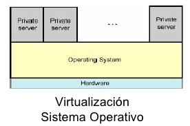

# Virtualització

## Què és?
Una capa de hw/sw que amaga els elements reals per a presentar uns recursos i informació (sistemes virtuales) a l'usuari i/o gestor sense necesitat d'accedir directamente als elements discrets (disc, memòria, CPU, xarxa...).”

##Tipus de virtualizació:
- **Emulació**
- **Virtualització total**
- **Paravirtualització**
- **Virtualització a nivell del sistema operatiu (Contenidors)**

## Tipus de Virtualització

## Emulació

- **Virtualització Hardware:** una capa d'emulació software permet accedir als recursos de la plataforma virtualitzada (s'emula una plataforma sobre una altra). Ex: Bochs, DOSBox, etc.

## Virtualització total

- **Hipervisor o virtual machine monitor (VMM):** Capa de programari/maquinari que permet emular hardware (màquines virtuals) de manera que es poden executar a sobre diferents sistemes operatius. Emula una quantitat suficient de hardware per que moltes instàncies d'un SO modificat o no funcionin concurrentement. Ex: Vmware, Virtual PC, VirtualBox, QEMU.

## Virtualització total

Es fa servir:

- **Traducció binària:** S'emula un conjunt d'instruccions (ex: plataforma x86 de 32 bits) que permet no haver de modificar el sistema operatiu convidat (guest). Ex: VMWare, VirtualBox.

- **Suport de la virtualizació nativa:** La plataforma x86 te alguns problemes (el sistema operatiu assumeix que té control absolut de la màquina) que fan que sigui difícil la virtualització. Així que les tecnologíes Intel VT y AMD-V permeten la virtualització sense modificar el sistema operatiu. Ex: KVM, VMware, VirtualBox, etc.

## Hipervisor Tipus I (BAREMETAL)

- **Tipus I:** També anomenat natiu, unhosted o bare metal (sobre el metall nu), és programari que s'executa directamente sobre el maquinari sense sistema operatiu, per oferir la funcionalidad de màquines virtuals.

**Característiques:** Millor rendiment i control, però tenen la limitació de hardware suportat reduït.

Ex: VMware ESXi (propietari), Xen (lliure), Citrix XenServer (gratis limitat a 4 maquines virtuals), Microsoft Hyper-V Server, Oracle VM (gratis).

## Hipervisor Tipus II (HOSTED)

- **Tipus II:** També anomenat "hosted", és programari  que s'executa sobre un sistema operatiu per oferir la funcionalidad de màquines virtuals..

**Característiques:** Menor rendiment que el Baremetal, però tenen suport per a més hardware ja que corren sobre el sistema operatiu.

## Paravirtualització

- La màquina virtual no necessàriament emula el hardware, sino que en el seu lloc (o a més) ofereix una sèrie d' APIs a un SO **modificat** per utilizar-les.

- Aquests sistemes ofereixen millor rendiment (s'apropen a un rendiment en màquina física).

- Ex: Xen, Sun xVM, User Mode Linux (UML)...

## Virtualització a nivell de sistema operatiu (Contenidors)

- El propi nucli del sistema operatiu permet crear múltiples instancies aïllades del sistema operatiu natiu en lloc d'una sola.

- Aquestes instàncies (contenidors) tenen entitat pròpia i són vistes com un servidor independent.

- Exemples: Linux-VServer, OpenVZ, Docker.

## Fonts d'informació

- https://en.wikipedia.org/wiki/Virtualization
- https://es.wikipedia.org/wiki/Hipervisor
- https://es.wikipedia.org/wiki/Paravirtualizaci%C3%B3n
- https://es.slideshare.net/pakus/virtualizacion-3246213
- https://www.vmware.com/techpapers/2007/understanding-full-virtualization-paravirtualizat-1008.html
